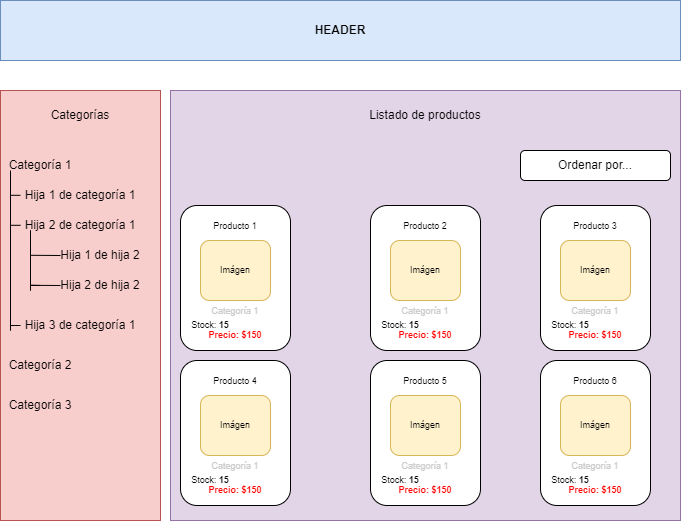

# Frontend challenge
Tenemos un cliente que nos pidió hacer un listado de productos y categorías. El listado de productos tiene que tener la posibilidad de ordenarse por nombre, precio y stock (Ascendente y descendentemente).

Se debe lograr un diseño parecido al siguiente:

En donde al clickear alguna de las categorías, me muestre los productos que pertenecen a esa categoría (Respetando también si elegí algún órden previamente).

## API
Por suerte, el cliente posee una API de la cual obtener las categorías y los productos! Tenemos los siguientes endpoints

- GET /api/categories -> Obtiene todas las categorías padre (Que no tienen hijas).
- GET /api/products -> Obtiene los productos junto con la categoría a la cual pertenecen.

Toda la documentación sobre los parámetros que reciben y lo que devuelve está [acá](https://api-challenge.rodrigorio.me/api/documentation)

## Consideraciones

- La API contiene más de 500 categorías y más de 500.000 productos, por lo cual los endpoints devuelven resultados **_paginados_**.
- El cliente es muy exigente con la **performance** de la web, por lo que quiere que todo se cargue en lo posible en menos de 4 segundos.
- Las categorías están armadas en estructura de **árbol**, en donde una categoría puede tener hijas y a su vez esas hijas pueden tener otras hijas y así infinitamente. El endpoint de categorías devuelve las categorías _principales_ (que son las que no tienen un padre) con sus hijas.